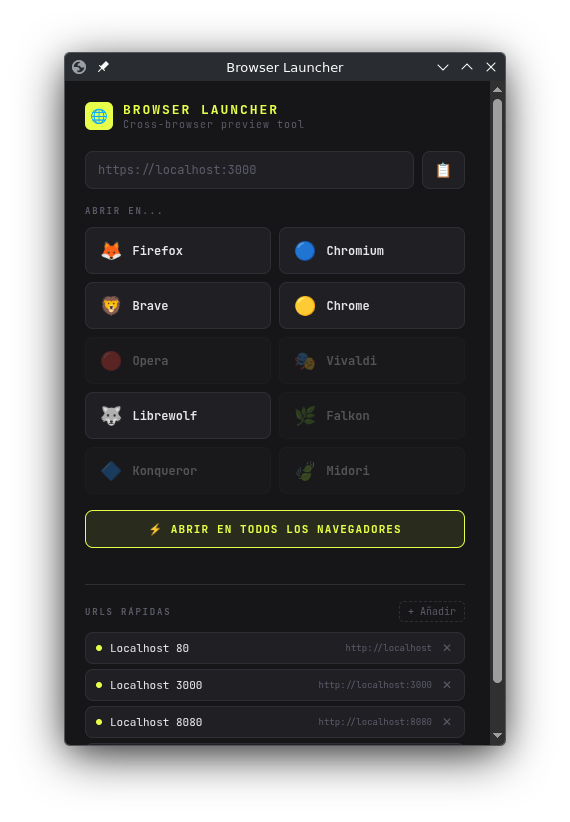

# 🌐 Browser Launcher

A minimal browser launcher for web developers on Linux. Opens any URL in multiple browsers simultaneously from a clean local web UI. Built for KDE Plasma, works on any Linux desktop.



## Why

When building websites you constantly need to check how they look across different browsers. Opening them one by one is slow and annoying. Browser Launcher puts a small panel on your desktop — type a URL, click a browser, done.

It complements responsive design tools like [ResponsivelyApp](https://responsively.app/) or [Polypane](https://polypane.app/), which show multiple viewports but all use the same rendering engine. Browser Launcher opens your page in the actual browsers installed on your system, so you can catch real rendering differences between Gecko (Firefox) and Blink (Chromium, Brave, Chrome).

## Features

- Detects installed browsers automatically — unavailable ones are grayed out
- Open in a single browser or all at once
- Quick URL list for your local dev servers and staging environments
- Runs as a local web app on `localhost:7700`
- Launches as a standalone app window in KDE Plasma (no browser chrome)
- Custom SVG icon included

## Requirements

- Python 3
- Chromium (to display the launcher UI as an app window)
- Any browsers you want to launch: Firefox, Brave, Chrome, Vivaldi, Librewolf...

## Installation

```bash
# 1. Clone the repo
git clone https://github.com/jferrep/browser-launcher.git
cd browser-launcher

# 2. Copy files to the install directory
mkdir -p ~/.local/share/browser-launcher
cp server.py browser-launcher.sh icon.svg ~/.local/share/browser-launcher/
chmod +x ~/.local/share/browser-launcher/browser-launcher.sh

# 3. Install the .desktop entry (KDE app menu)
cp browser-launcher.desktop ~/.local/share/applications/
sed -i "s|%h|$HOME|g" ~/.local/share/applications/browser-launcher.desktop
```

## Usage

```bash
bash ~/.local/share/browser-launcher/browser-launcher.sh
```

Or launch it from the KDE application menu — search for **Browser Launcher**.

### Pin to taskbar

Once the window is open, right-click it in the taskbar → **Pin to Task Manager**.

### Run as a floating app window

```bash
chromium --app=http://localhost:7700 --window-size=440,600 \
  --user-data-dir="$HOME/.local/share/browser-launcher/chromium-profile" \
  > /dev/null 2>&1 &
```

## Supported browsers

The following browsers are detected automatically if installed:

| Browser   | Command                |
| --------- | ---------------------- |
| Firefox   | `firefox`              |
| Chromium  | `chromium`             |
| Brave     | `brave`                |
| Chrome    | `google-chrome-stable` |
| Opera     | `opera`                |
| Vivaldi   | `vivaldi-stable`       |
| Librewolf | `librewolf`            |
| Falkon    | `falkon`               |
| Konqueror | `konqueror`            |
| Midori    | `midori`               |

To add more, edit the `BROWSERS` list in `server.py`.

## Emoji support

The UI uses emoji icons. On Arch Linux you may need to install the Noto emoji font and download the TTF manually if the package doesn't place the file correctly:

```bash
sudo pacman -S noto-fonts-emoji
sudo curl -L "https://github.com/googlefonts/noto-emoji/raw/main/fonts/NotoColorEmoji.ttf" \
  -o /usr/share/fonts/noto/NotoColorEmoji.ttf
sudo fc-cache -fv
```

## Related

This tool was built as part of a blog post about cross-browser preview workflows for web developers → [jaumeferre.net](https://jaumeferre.net)

## License

MIT
